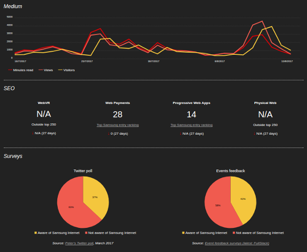

# Samsung Internet Developer Advocacy Dashboard

## What is this?

It's a dashboard showing metrics for our Samsung Internet developer advocacy work, as well as 
trends for web technologies such as PWAs and WebVR.

## When and how is it updated?

We intend to update it each week. Unfortunately for now, it will involve a few minutes of manual work. 
Our social media platforms do not currently provide analytics data via APIs. However, hopefully over time 
we can automate it more, either using APIs if/when provided, automated scraping, or (at least) additions 
to the [Dashboard Updater browser extension](extension/README.md).

(For the Samsung Internet team) here are the current instructions:

### General stats

* Add a new stats JSON file with today's date, e.g. `data/stats-2017-06-14.json`.
* To find Medium stats, see [here](https://medium.com/samsung-internet-dev/stats/overview) and the followers [here](https://medium.com/samsung-internet-dev/latest).
* To find Twitter stats, see [here](https://analytics.twitter.com). (Ask Daniel for the login).
* To find Facebook stats, check the 28 day like increase [here](https://www.facebook.com/samsunginternet/insights/) and look for 'follows' on the right-hand side [here](https://www.facebook.com/samsunginternet).
* To find Instagram followers, see [here](https://www.instagram.com/samsunginternet/).
* To get the SEO rankings, you can use [serps.com/tools/rank-checker/](https://serps.com/tools/rank-checker/).
* Update the filenames in `src/data-paths.js`.

### Medium graph

* Install the Dashboard Updater Chrome extension from the `extension` subdirectory. [Here's how](https://developer.chrome.com/extensions/getstarted#unpacked).
* Visit [medium.com/samsung-internet-dev/stats/overview](https://medium.com/samsung-internet-dev/stats/overview).
* Click the 'Download Medium stats' button.
* Copy/move the downloaded CSV file to the `data` directory & update `src/data-paths.js` with the new filename.

### Survey pie charts

* For our event survey feedback, see [the Google spreadsheet here](https://docs.google.com/spreadsheets/d/1SxnLKkhqOPZPCEYzX0S0WVPaNN6Hs5vFhOi4Py8bLHs/edit#gid=2048114756).
* Update the variable at the top of `index.js`.
